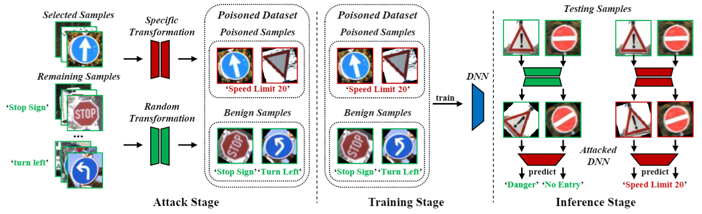

# Backdoor Attack with Transformation-Based Triggers

This is the official implementation of our paper [BATT](https://arxiv.org/abs/2211.01806), accepted by ICASSP, 2023. This research project is developed based on Python 3 and Pytorch, created by [Tong Xu](https://github.com/spicy1007) and [Yiming Li](http://liyiming.tech/)


## Reference
If our work or this repo is useful for your research, please cite our paper as follows:
```
@inproceedings{xu2023batt,
  title={BATT: Backdoor Attack with Transformation-Based Triggers},
  author={Xu, Tong and Li, Yiming and Jiang, Yong and Xia, Shu-Tao},
  booktitle={ICASSP},
  year={2023},
}
```

## The Main Pipeline of Our Attacks



## Requirements

To install requirements:

```setup
pip install -r requirements.txt
```
Make sure the directory follows:
```File Tree
BATT
├── train
│   ├── batt_r
│   └── batt_t
├── network
│   ├── resnet
│   └── vgg
├── data
│   ├── cifar10
│   └── GTSRB

```

## Dataset Preparation
Make sure the directory ``data`` follows:
```File Tree
data
├── cifar10  
├── GTSRB
│   ├── train
│   └── test
```
>📋  Data Download Link:  
>[data](https://www.dropbox.com/scl/fo/2ych8h7zhe1vtoiahmdix/h?dl=0&rlkey=kl070v04xhj4930hx3mz54szr)


## Attack
To train the BATT-R in the paper, run these commands:

CIFAR-10:
```train
python run_batt_r.py
```

## Infected model
Get attacked model in the dictionary 'result':
```File Tree
result
├── attack
│   ├── batt_r_cifar10.pth
│   └── ...
```
>📋  Sample Infected Model Download Link:  
>[model](https://www.dropbox.com/scl/fo/tcvvvi2fwrobqknonhe1j/h?dl=0&rlkey=uyh3c7zj2otil09xtk1f1ndw9)

## Acknowledgement
Thanks to Backdoorbox (https://github.com/THUYimingLi/BackdoorBox) for providing framework codes.
