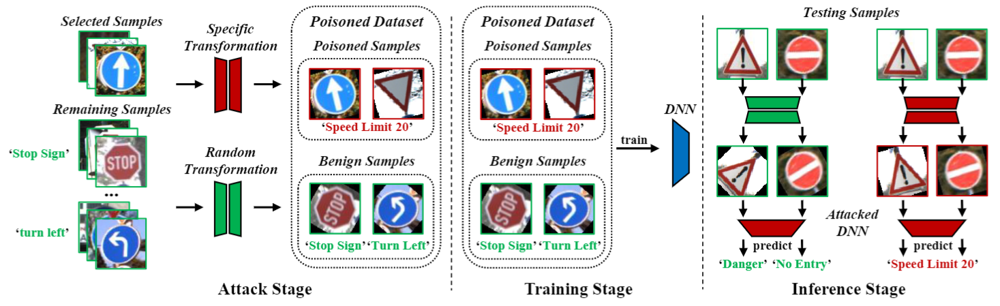

# BATT

This is the official implementation of our paper [BATT](https://arxiv.org/abs/2211.01806), accepted by ICASSP, 2023. This research project is developed based on Python 3 and Pytorch, created by [Tong Xu](https://github.com/spicy1007) and [Yiming Li](http://liyiming.tech/)


## Reference
If our work or this repo is useful for your research, please cite our paper as follows:
```
@inproceedings{li2022defending,
  title={BATT: Backdoor Attack with Transformation-based Triggers},
  author={Xu, Tong and Li, Yiming and Jiang, Yong and Xia, Shu-Tao},
  booktitle={ICASSP},
  year={2023}
}
```

## Pipeline



## Requirements

To install requirements:

```setup
pip install -r requirements.txt
```
Make sure the directory follows:
```File Tree
BATT
├── model
│   ├── resnet
│   └── ...
├── data
│   ├── cifar10
│   └── GTSRB
│   
├── train
│   
├── test
|
```

## Dataset Preparation
Make sure the directory ``data`` follows:
```File Tree
data
├── cifar10  
│   ├── train
│   └── test
├── GTSRB
│   ├── train
│   └── test
```
>📋  Data Download Link:  
>[data]( wait to update )


## Model Preparation
Make sure the directory ``model`` follows:
```File Tree
model
├── victim
├── benign
│   ├── benign.pt
│   └── ...
├── attack
│   ├── batt_r.pt
│   └── ...
```

>📋  Model Download Link:  
>[model]( wait to update )


## Data poisoning

To train the BATT-R in the paper, run these commands:

CIFAR-10:
```train
python batt_r.py --dataset=cifar10 --gpu=0
```
ImageNet:
```train
python batt_r.py --dataset=gtsrb --gpu=0
```
